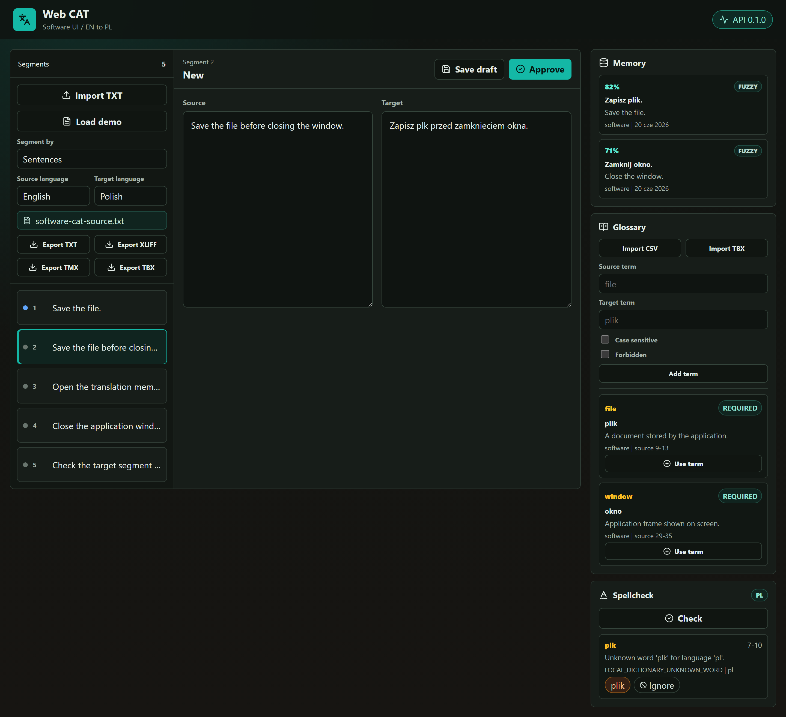

# web-cat

[](https://github.com/adamjankowiak/web-cat/actions/workflows/ci.yml)
[](LICENSE)
[](apps/api/pyproject.toml)
[](apps/frontend/package.json)

Webowa platforma CAT (Computer-Assisted Translation) wspierajaca przeplyw pracy tlumacza
nad segmentowanym dokumentem EN-PL. MVP laczy edytor segmentow, pamiec tlumaczen,
slownik kontekstowy, walidacje terminologii, prosty spellcheck oraz eksport formatow CAT.

## Zrzuty ekranu

Edytor segmentow z aktywnym segmentem oraz panelami pamieci tlumaczen (exact/fuzzy match),
slownika kontekstowego (terminy wymagane i zakazane) i sprawdzania pisowni:



> Zrzut powstaje z prawdziwego interfejsu (Vite) z zamockowanym API i danymi demo.
> Mozna go odtworzyc skryptem `apps/frontend/scripts/capture-screenshots.mjs`
> (`npm run screenshots` przy uruchomionym `npm run dev`).

## Spis tresci

- [Zrzuty ekranu](#zrzuty-ekranu)
- [Co jest wdrozone w MVP](#co-jest-wdrozone-w-mvp)
- [Struktura](#struktura)
- [Szybki start z DEMO](#szybki-start-z-demo)
- [Uruchomienie lokalne](#uruchomienie-lokalne)
- [Uruchomienie przez Docker](#uruchomienie-przez-docker)
- [Testy i jakosc](#testy-i-jakosc)
- [Scenariusz demo](#scenariusz-demo)
- [Szybkie API](#szybkie-api)
- [Ograniczenia MVP i rozszerzenia](#ograniczenia-mvp-i-rozszerzenia)
- [Dokumentacja projektowa](#dokumentacja-projektowa)
- [Licencja](#licencja)

## Co jest wdrozone w MVP

- Import dokumentu TXT i segmentacja po zdaniach albo akapitach.
- Edytor webowy z lista segmentow, aktywnym segmentem, zapisem draftu i zatwierdzaniem.
- Pamiec tlumaczen: exact match, fuzzy match przez RapidFuzz i zapis segmentu po approve.
- Slownik kontekstowy: CRUD, import CSV, import/eksport TBX, terminy wymagane i zakazane.
- Walidacja terminologii przy zatwierdzaniu segmentu.
- Spellcheck tekstu docelowego z lokalnym deterministycznym slownikiem dla `pl`, `en` i `de`.
- Eksport dokumentu do TXT i XLIFF.
- Import/eksport pamieci tlumaczen w minimalnym subsetcie TMX.
- Testy backendu, testy komponentow frontendu, test e2e MVP i pipeline GitHub Actions.

## Struktura

- `apps/api` - backend FastAPI, SQLAlchemy, Alembic i testy backendu.
- `apps/frontend` - frontend React/Vite, Vitest, React Testing Library i Playwright.
- `libs/shared` - recznie utrzymywany kontrakt OpenAPI i typy referencyjne (nieimportowane
  przez aplikacje w MVP).
- `data/samples` - male dane demonstracyjne EN-PL dla domeny software/CAT.
- `docs` - plan etapow, model danych, moduly CAT, kontrakty API oraz DevOps/testy.
- `infra` - konfiguracje Docker i inicjalizacja Postgresa.
- `scripts` - pomocnicze skrypty PowerShell (`dev.ps1`, `seed_data.ps1`).
- `tests` - test e2e i fixture'y.

## Szybki start z DEMO

Po sklonowaniu repozytorium najkrotsza sciezka do gotowego scenariusza wyglada tak:

### Docker

```powershell
Copy-Item .env.example .env
docker compose up -d --build
docker compose exec -T api alembic upgrade head
```

Otworz `http://localhost:5173` i kliknij `Load demo`.

### Lokalnie

Uruchom backend i frontend zgodnie z sekcja [Uruchomienie lokalne](#uruchomienie-lokalne),
a potem otworz `http://localhost:5173` i kliknij `Load demo`.

Przycisk `Load demo` wywoluje `POST /demo/seed` i laduje do bazy gotowy zestaw z
`data/samples`:

- dokument `software-cat-source.txt`,
- startowa pamiec tlumaczen `software-cat-memory.tmx`,
- slownik `software-cat-glossary.tbx` z terminami wymaganymi i zakazanymi.

Po zaladowaniu demo w edytorze od razu widac segmenty dokumentu, sugestie pamieci
tlumaczen, terminy slownikowe i spellcheck dla jezyka docelowego. Endpoint seedujacy jest
idempotentny dla dokumentu demo, wiec ponowne klikniecie nie tworzy kolejnych kopii dokumentu.
Obraz API w Dockerze zawiera pliki `data/samples`, wiec demo dziala tak samo w kontenerach
i lokalnie.

## Uruchomienie lokalne

Backend:

```powershell
Copy-Item .env.example .env
cd apps/api
python -m pip install -e .[dev]
alembic upgrade head
python -m uvicorn cat_api.main:app --reload
```

Frontend:

```powershell
cd apps/frontend
npm install
npm run dev
```

Adresy po starcie:

- API: `http://localhost:8000/health`
- OpenAPI FastAPI: `http://localhost:8000/docs`
- frontend: `http://localhost:5173`

Pomocniczy skrypt PowerShell:

```powershell
.\scripts\dev.ps1 api
.\scripts\dev.ps1 frontend
.\scripts\dev.ps1 migrate
.\scripts\dev.ps1 test-api
.\scripts\dev.ps1 test-frontend
.\scripts\dev.ps1 test-e2e
```

## Uruchomienie przez Docker

Pelny stack Docker uruchamia wariant Docker z sekcji [Szybki start z DEMO](#szybki-start-z-demo).
Te same komendy wystawiaja API na `http://localhost:8000` i frontend na
`http://localhost:5173`. Demo jest opcjonalne i laduje sie dopiero po kliknieciu `Load demo`
albo wywolaniu `POST /demo/seed`.

Wymagania: uruchomiony Docker Desktop, aktywny Linux Engine i wolne porty `5432`,
`6379`, `8000` oraz `5173`.

Jesli Docker zwroci blad podobny do
`failed to connect to the docker API at npipe:////./pipe/dockerDesktopLinuxEngine`,
uruchom Docker Desktop, poczekaj na status `Docker Desktop is running`, a potem sprawdz:

```powershell
docker version
docker compose config
```

## Testy i jakosc

Backend:

```powershell
cd apps/api
python -m pytest
python -m ruff check .
python -m ruff format --check .
```

Frontend:

```powershell
cd apps/frontend
npm run lint
npm run build
npm run test
```

E2E:

```powershell
cd apps/frontend
npx playwright install chromium
npm run test:e2e
```

Test e2e uruchamia frontend Vite i mockuje odpowiedzi API, dzieki czemu nie wymaga
lokalnego backendu ani bazy danych. Pelna integracja z prawdziwym backendem pozostaje
mozliwa jako rozszerzenie testow po MVP.

## Scenariusz demo

Dane demonstracyjne sa w `data/samples`:

- `data/samples/documents/software-cat-source.txt` - dokument TXT do importu.
- `data/samples/translation-memory/software-cat-memory.tmx` - startowa pamiec tlumaczen.
- `data/samples/glossaries/software-cat-glossary.csv` - slownik CSV.
- `data/samples/glossaries/software-cat-glossary.tbx` - slownik TBX.
- `data/samples/spellcheck-target-with-error.txt` - tekst z celowym bledem spellcheck.

Po zaladowaniu demo otworz pierwszy segment, wpisz `Zapisz plk.`, uruchom spellcheck,
zastosuj sugestie `plik`, zatwierdz segment, przejdz do podobnego segmentu i sprawdz
sugestie TM oraz terminy slownikowe. Na koniec pobierz wynik przez `Export TXT`.

## Szybkie API

Import dokumentu:

```powershell
$payload = @{
  filename = "sample.txt"
  content = "Save the file. Close the window."
  source_language = "en"
  target_language = "pl"
  segmentation_strategy = "sentence"
} | ConvertTo-Json

Invoke-RestMethod -Uri http://localhost:8000/documents -Method Post -ContentType "application/json" -Body $payload
```

Zaladowanie danych demo:

```powershell
Invoke-RestMethod -Uri http://localhost:8000/demo/seed -Method Post
```

Eksporty:

```powershell
$document = Invoke-RestMethod -Uri http://localhost:8000/documents -Method Post -ContentType "application/json" -Body $payload
$documentId = $document.document.id

Invoke-WebRequest -Uri "http://localhost:8000/documents/$documentId/export.txt" -OutFile translated.txt
Invoke-WebRequest -Uri "http://localhost:8000/documents/$documentId/export.xliff" -OutFile document.xliff
Invoke-WebRequest -Uri "http://localhost:8000/translation-memory/export.tmx" -OutFile translation-memory.tmx
Invoke-WebRequest -Uri "http://localhost:8000/glossary/export.tbx" -OutFile glossary.tbx
```

Import TMX i TBX przyjmuje XML w ciele requestu:

```powershell
Invoke-RestMethod -Uri http://localhost:8000/translation-memory/import-tmx -Method Post -ContentType "application/xml" -InFile translation-memory.tmx
Invoke-RestMethod -Uri http://localhost:8000/glossary/import-tbx -Method Post -ContentType "application/xml" -InFile glossary.tbx
```

Importy XML odrzucaja deklaracje DTD/DOCTYPE (ochrona przed atakami typu entity-expansion),
a serwer odrzuca zadania o ciele wiekszym niz 10 MB (`max_request_body_bytes`).

## Ograniczenia MVP i rozszerzenia

- Spellcheck jest uproszczonym lokalnym adapterem slownikowym, a nie pelna korekta
  gramatyczno-stylistyczna.
- TMX, TBX i XLIFF obsluguja swiadomie ograniczony subset potrzebny do prezentacji MVP.
- Aplikacja nie ma pelnego uwierzytelniania i wielouzytkownikowych uprawnien.
- Importy, eksporty i indeksowanie sa synchroniczne; asynchroniczny worker pozostaje
  proponowanym rozszerzeniem (brak implementacji).
- Terminologia nie uwzglednia fleksji ani lematyzacji jezyka polskiego.
- Naturalne rozszerzenia: LanguageTool, Hunspell, lematyzacja, import XLIFF, semantyczna
  pamiec tlumaczen, ICE/context match, async workers i pelny model projektow/uzytkownikow.

## Dokumentacja projektowa

- [Wprowadzenie](docs/00-wprowadzenie.md)
- [Stack i architektura](docs/01-stack-i-architektura.md)
- [Plan etapow](docs/02-plan-etapow.md)
- [Model danych](docs/03-model-danych.md)
- [Moduly CAT](docs/04-moduly-cat.md)
- [Notebooki i eksperymenty](docs/05-notebooks-i-eksperymenty.md)
- [Kontrakty API](docs/06-api-kontrakty.md)
- [DevOps i testy](docs/07-devops-i-testy.md)
- [Opcjonalna mapa laboratoriow](docs/08-mapa-laboratoriow.md)
- [Koncepcja projektu i narzedzia](docs/09-koncepcja-projektu-i-narzedzia.md)

## Licencja

Projekt jest udostepniany na licencji [MIT](LICENSE).
